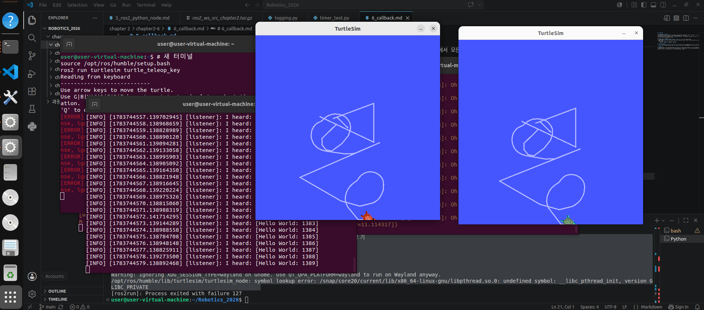

# 7_topic.md

## 1. ROS2 토픽(Topic) 개념 조사
- **토픽(Topic)**: 노드 간의 데이터 통신을 위한 비동기 메시지 버스입니다. '게시자(Publisher)'가 토픽에 데이터를 게시(Publish)하면, 해당 토픽을 '구독(Subscription)'하는 모든 노드가 데이터를 받는 단방향 통신 구조입니다. 
- **특징**: 노드 간의 직접적인 연결 없이 토픽이라는 인터페이스를 통해 통신하므로, 느슨한 결합(Loose Coupling)을 지원하며 일대다(1:N) 통신이 가능합니다.

## 2. demo_nodes_cpp 실습 및 명령어 분석
- **rqt_graph**: talker와 listener 노드가 /chatter 토픽을 매개로 연결되어 있음을 시각적으로 확인하였습니다. (rqt_graph 이미지 첨부)
- **주요 명령어**:
    - `ros2 topic list`: 활성 중인 모든 토픽 목록 확인.
    - `ros2 topic info /chatter`: 메시지 타입(std_msgs/msg/String) 및 pub/sub 관계 확인.
    - `ros2 topic echo /chatter`: 토픽을 통해 전달되는 실제 메시지 데이터를 실시간으로 모니터링.

## 3. Turtlesim 멀티 노드 실험
- **실험 환경**: 2개의 `turtlesim_node`와 1개의 `turtle_teleop_key` 노드 실행.
- **결과**: 키보드 노드를 통해 명령을 내리면 두 개의 거북이가 동시에 동일하게 움직이는 것을 확인하였습니다.
- **이미지**: 
   
  *(※ 캡처하신 이미지 파일명으로 바꿔주세요)*

## 4. 토픽 정보 분석 (`/turtle1/cmd_vel`)
- **명령어**: `ros2 topic info /turtle1/cmd_vel`
- **결과**:
    - **Publisher count**: 1
    - **Subscription count**: 2
    - **메시지 타입**: `geometry_msgs/msg/Twist`
- **분석**: 하나의 게시자(키보드 제어 노드)가 보내는 명령을 두 개의 구독자(turtlesim_node 1, 2)가 동시에 수신하고 있습니다. 이는 ROS2의 토픽 통신이 다수의 노드에게 동일한 데이터를 배포하는 브로드캐스팅(Broadcasting) 방식임을 증명합니다.

## 5. 실습 소감
- 로봇 시스템에서 센서 데이터와 제어 명령을 어떻게 여러 노드에 공유하는지 '토픽'을 통해 확실히 이해했습니다. 
- 특히 turtlesim 실험을 통해 하나의 제어 노드가 다수의 수신 노드를 동시에 제어하는 구조를 직접 경험했습니다. 환경 설정 문제로 실행에 어려움이 있었으나, 해결 과정을 통해 라이브러리 경로와 환경 변수의 중요성을 깊이 체감할 수 있었습니다.