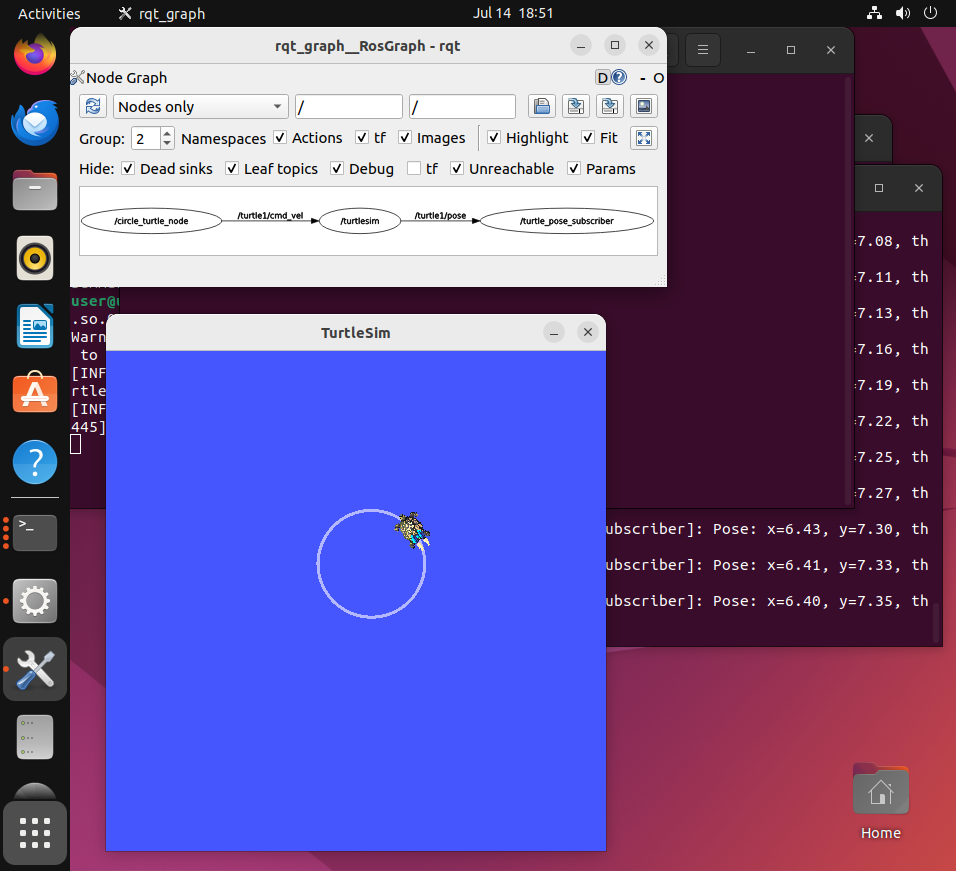

# 9_subscriber.md: ROS2 서브스크라이버 구현 및 시스템 통합

## 1. 실습 개요
- **학습 목표:** ROS2의 서브스크라이버(Subscriber) 개념을 이해하고, `turtlesim`의 `/turtle1/pose` 토픽을 구독하여 로봇의 현재 상태를 실시간으로 로깅하는 노드를 구현함.
- **개발 환경:** Ubuntu 22.04 LTS, ROS2 Humble

## 2. 세부 실습 과정

### 2.1 토픽 분석
- `ros2 topic list`를 통해 활성화된 토픽 확인.
- `ros2 interface show turtlesim/msg/Pose` 명령어를 사용하여 메시지 타입을 조사함.
  - **구조:** `x`, `y`, `theta` (위치/방향), `linear_velocity`, `angular_velocity` (속도)로 구성됨.

### 2.2 노드 구현 (`turtle_pose.py`)
- `turtlesim.msg.Pose` 타입을 구독하는 서브스크라이버 노드 작성.
- 콜백 함수(`listener_callback`) 내부에서 속도 정보를 제외한 위치 및 각도 정보만 파싱하여 `self.get_logger().info()`를 통해 출력하도록 구현함.

### 2.3 패키지 등록 및 빌드
- `setup.py`의 `entry_points`에 `'turtle_pose = my_robot_controller.turtle_pose:main'`을 추가함.
- `colcon build --packages-select my_robot_controller --symlink-install` 명령으로 빌드 수행.

## 3. 트러블슈팅 (문제 해결 과정)

### 3.1 패키지 인식 오류 (Package not found)
- **현상:** `ros2 run` 실행 시 패키지를 찾을 수 없다는 에러 발생.
- **해결:** 터미널 세션마다 `source ~/ros2_ws/install/setup.bash` 명령을 통해 워크스페이스를 다시 로드해야 함을 학습함. 향후 편의를 위해 `.bashrc` 파일에 해당 명령을 영구 등록함.

### 3.2 시스템 비정상 종료 (우분투 튕김)
- **현상:** 실습 중 OS가 예기치 않게 종료됨.
- **해결:** 빌드 환경이 꼬일 것을 대비하여 다시 `colcon build`를 실행하여 워크스페이스를 재정비하고, `LD_PRELOAD` 설정을 포함한 기존 실행 명령어를 통해 `turtlesim` 노드를 복구함.

## 4. 최종 결과물

### 4.1 시각화 (rqt_graph)

- `circle_turtle` 노드(퍼블리셔)가 `/turtle1/cmd_vel`을 발행하여 거북이를 제어함.
- `turtle_pose` 노드(서브스크라이버)가 `/turtle1/pose`를 구독하여 상태를 실시간 로깅함.

## 5. 학습 소감
단순히 예제를 따라가는 것을 넘어, 환경 변수 설정과 시스템 재빌드 등 실제 개발 환경에서 발생할 수 있는 문제들을 직접 해결해 보며 ROS2 워크스페이스의 동작 원리를 몸소 익혔습니다. 특히 퍼블리셔와 서브스크라이버를 조합하여 제어(명령)와 모니터링(데이터 수신)이 동시에 이루어지는 구조를 보며, 실제 자율주행 로봇 제어 시스템의 뼈대를 이해하게 되었습니다.
