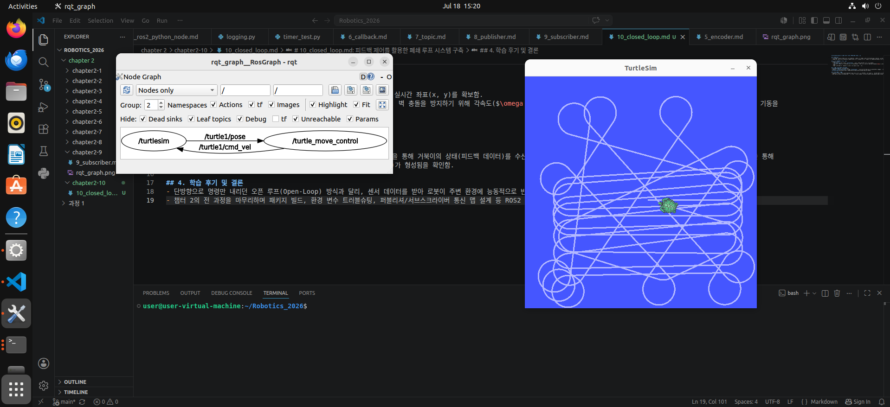
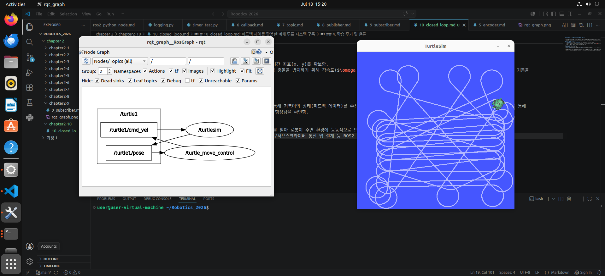

# 10_closed_loop.md: 피드백 제어를 활용한 폐쇄 루프 시스템 구축

## 1. 실습 목표
- 퍼블리셔와 서브스크라이버를 단일 노드 내에 복합 구현하여 센서 기반 피드백 제어(Closed-Loop) 시스템을 구축한다.
- 로봇의 현재 위치 좌표를 실시간으로 모니터링하여 벽 충돌 위험을 감지하고, 스스로 회피 기동을 수행하도록 제어 알고리즘을 설계한다.

## 2. 제어 메커니즘 및 코드 구현
- **동작 논리**: 
  - `turtlesim_node`가 발행하는 `/turtle1/pose` 토픽을 구독하여 실시간 좌표(x, y)를 확보함.
  - 안전 경계 구간($x, y < 2.0$ 또는 $x, y > 9.0$)에 진입할 경우, 벽 충돌을 방지하기 위해 각속도($\omega = 1.4$)와 감소된 선속도($v = 1.0$)를 동시에 부여해 부드러운 곡선 회피 기동을 유도함.
  - 안전 구역 내에서는 선속도($v = 2.2$)를 주어 직진 주행을 유지함.

## 3. 통신 구조 시각화 (rqt_graph)

- **분석**: `turtle_move_control` 노드가 `/turtle1/pose` 토픽을 통해 거북이의 상태(피드백 데이터)를 수신하고, 이를 기반으로 판단한 제어 명령을 다시 `/turtle1/cmd_vel` 토픽을 통해 `turtlesim_node`에 전달하는 완벽한 폐쇄형 데이터 루프(Closed-Loop)가 형성됨을 확인함.

## 4. 학습 후기 및 결론
- 단방향으로 명령만 내리던 오픈 루프(Open-Loop) 방식과 달리, 센서 데이터를 받아 로봇이 주변 환경에 능동적으로 반응하는 진정한 의미의 '로봇 제어'를 실습해 볼 수 있었습니다.
- 챕터 2의 전 과정을 마무리하며 패키지 빌드, 환경 변수 트러블슈팅, 퍼블리셔/서브스크라이버 통신 맵 설계 등 ROS2 프레임워크의 코어 프로세스를 탄탄히 체득하게 되었습니다.