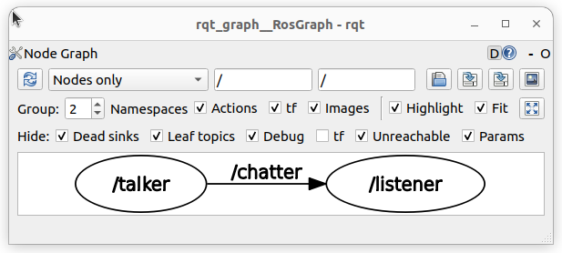
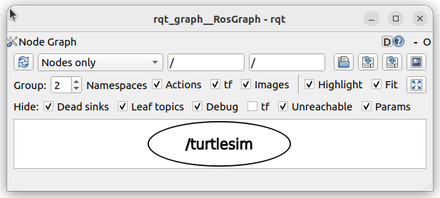

# ROS2 노드(Node) 실습 보고서

## 1. 노드(Node)의 개념 조사
- **노드(Node)란?**: ROS2 시스템 내에서 특정 작업을 수행하는 최소 단위의 실행 프로세스입니다. 예를 들어 센서 데이터를 읽거나, 모터를 제어하거나, 데이터를 처리하는 등 하나의 목적을 가진 프로그램입니다. 노드들은 서로 데이터를 주고받으며(Topic, Service, Action 등) 거대한 로봇 시스템을 구성합니다.

## 2. demo_nodes_cpp 실습 결과
- **설명**: `talker` 노드는 메시지를 발행(Publish)하고, `listener` 노드는 이를 구독(Subscribe)하여 통신합니다.
- **rqt_graph 분석**: `Nodes only` 모드 확인 결과, talker에서 listener로 화살표가 이어져 데이터가 흐르는 것을 확인했습니다.
- **명령어 확인**:
    - `ros2 node list`: 현재 활성화된 노드 목록(`talker`, `listener`) 출력 확인.
    - `ros2 node info /talker`: 해당 노드의 퍼블리셔/서브스크라이버/서비스 정보 출력 확인.
- **이미지**: 

## 3. Turtlesim 실습 결과
- **실행**: `turtlesim_node`(거북이 화면)와 `turtle_teleop_key`(키보드 조작) 노드 실행.
- **관계 분석**: `turtle_teleop_key` 노드는 키보드 입력값을 받아 `/turtle1/cmd_vel` 토픽으로 데이터를 발행하고, `turtlesim_node`는 이를 구독하여 거북이를 움직입니다.
- **이미지**: 