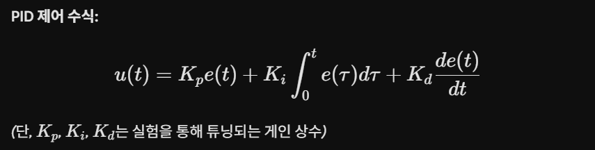

## 문제 정의
김대리는 부품과 제품을 공정 간에 운송하는 과정을 자동화하는 프로토타입 운반 로봇을 개발하고자 하며, 이 로봇은 바닥에 그려진 검은색 선(경로)을 인식하여 자율적으로 이동하고, 이동 기록 데이터를 수집하는 것이 목표로 한다

## 요구 사항 정리:
1. 바닥의 검은색 선(경로)을 인식할 수 있어야 한다.
2. 인식된 경로를 따라 자율적으로 이동할 수 있어야 한다.
3. 이동 경로와 시간, 위치 데이터를 기록하고 저장할 수 있어야 한다.
4. 실시간으로 데이터를 수집하고 저장하는 기능이 필요하다.
5. 프로토타입 하드웨어와 소프트웨어를 제작할 수 있어야 한다.

## 공정 간 운송 로봇 프로토타입 시스템 아키텍처

1. 하드웨어 아키텍처 (Hardware Architecture)

- 안정적인 비전 데이터 처리와 실시간 주행 로그 기록을 위해 고성능 마이크로컴퓨터와 정밀 제어 부품을 기반으로 시스템을 구성한다.

메인 제어기 (NVIDIA Jetson Orin Nano): 영상 데이터를 실시간으로 처리하고 주행 알고리즘 연산 및 전체 시스템을 제어한다.

스토리지 (NVMe SSD): 대용량 주행 로그 데이터(CSV)를 병목 없이 고속으로 안정성 있게 로컬에 저장한다.

비전 센서 (CSI Camera Module): 바닥의 검은색 주행 경로 영상을 지연 없이 실시간으로 획득한다.

구동부 모터 (Stepper Motor): 좌우 바퀴에 장착되어 오차 없는 정밀한 회전 각도 및 속도 제어를 수행한다.

모터 제어 (Motor Driver): 메인 제어기의 제어 신호를 받아 스텝 모터를 구동할 전력을 공급한다.

전원부 (Li-Po 배터리 및 전압 레귤레이터): 모터 구동용 전력과 제어기용 전압을 분리하여 시스템에 안정적인 전원을 공급한다.

2. 소프트웨어 아키텍처 (Software Architecture)

- 시스템은 크게 영상 처리, 주행 제어, 데이터 로깅의 세 가지 모듈로 구성되며, 멀티스레딩(Multi-threading) 환경에서 병렬로 동작한다.

2.1 비전 기반 라인 인식 모듈 (Vision Processing)

프레임워크: OpenCV

처리 흐름:

CSI 카메라로부터 실시간 프레임 획득

그레이스케일(Grayscale) 변환 및 이진화(Thresholding)를 통해 하얀 바닥과 검은 선 분리

관심 영역(ROI, Region of Interest) 설정 및 검은 선의 무게중심(Center of Mass) X 좌표 추출

화면 중심(로봇의 중앙)과 선의 중심 간의 픽셀 차이를 오차(Error)로 산출

2.2. 주행 제어 모듈 (Control Logic)
제어 알고리즘: PID 제어 (Proportional-Integral-Derivative Control)

산출된 오차 데이터 $e(t)$를 바탕으로 양쪽 스텝 모터의 인가 속도를 조절하여 로봇이 선의 중앙에 위치하도록 제어한다.

PID 제어 수식:

계산된 제어값 u(t)에 따라 좌/우 스텝 모터 드라이버에 펄스(Pulse) 신호를 인가하여 속도 차이를 발생시킨다.

2.3. 데이터 로깅 모듈 (Data Logging)
기록 주기: 1초 (1Hz)

저장 위치: NVMe SSD 내부 지정 디렉토리

파일 포맷: CSV (분석 및 확장성을 고려)

기록 데이터 항목 (Columns):

Timestamp: 데이터 기록 시각 (YYYY-MM-DD HH:MM:SS.ms)

Error_Value: 비전 모듈에서 계산된 라인 중심과의 오차 픽셀 값

Motor_Left_Speed, Motor_Right_Speed: 좌우 모터에 인가된 속도 명령값

Status: 현재 상태 코드 (주행 중, 경로 이탈 정지, 정상 종료 등)

3. 시스템 데이터 흐름도 (System Data Flow)
[Input] CSI 카메라 -> 비전 모듈 (라인 오차 계산)
[Process] 오차 데이터 -> PID 제어기 (모터 속도 차이 연산)
[Output] 연산 결과 -> 모터 드라이버 -> 스텝 모터 구동 (물리적 조향)
[Logging] 시스템 상태 및 연산 데이터 -> 비동기 로깅 스레드 -> NVMe SSD (CSV 저장)
[Exception] 라인 미검출 시 -> 제어기 인터럽트 -> 모터 정지 및 에러 로그 기록

 ## 보기는 Ctrl+Shift+v로 보기