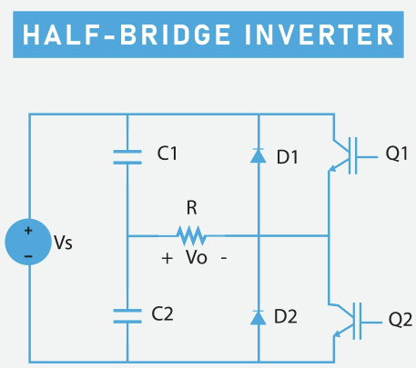

1. 모터의 기본 유형

DC 모터 (Direct Current Motor)
특징: 구조가 간단하고 전압을 인가하면 즉시 회전합니다. 속도와 방향 제어가 직관적이며, 로봇 바퀴 구동에 주로 쓰입니다.

작동 원리: 자기장 내에서 전류가 흐르는 도선이 힘을 받는 원리(플레밍의 왼손 법칙)를 이용합니다.

서보 모터 (Servo Motor)
특징: DC 모터에 제어 회로와 위치 센서가 결합된 형태입니다. 특정 각도(예: 0~180도)로 정밀하게 이동하고 그 위치를 유지하는 능력이 탁월합니다.

작동 원리: 내부의 가변저항을 통해 현재 각도를 피드백 받아 목표 위치까지 이동합니다.

2. 모터의 사양을 구성하는 항목

정격 전압 (Rated Voltage): 모터가 정상적인 성능을 내기 위해 필요한 입력 전압입니다. (예: 5V, 12V, 24V)

토크 (Torque): 모터가 물체를 회전시키는 힘입니다. 로봇의 무게와 바퀴의 크기를 고려하여 필요한 토크 값을 선정해야 합니다.

RPM (Revolutions Per Minute): 분당 회전수입니다. 로봇의 주행 속도와 직결됩니다.

정격 전류 (Rated Current): 모터가 작동할 때 소모하는 전류량입니다. 모터 드라이버의 용량(허용 전류)을 결정하는 기준이 됩니다.

3. 모터의 제어 원리

회전 속도 제어: PWM (Pulse Width Modulation)
모터에 인가되는 전압을 단순히 키우는 대신, 전압을 아주 빠르게 껐다 켰다(On/Off) 하는 방식을 사용합니다.

Duty Cycle: 한 주기 동안 'On' 상태인 시간의 비율을 조절합니다. 'On' 시간이 길수록 평균 전압이 높아져 모터가 빠르게 회전합니다.

회전 방향 제어: H-브리지 (H-Bridge)
모터에 흐르는 전류의 방향을 바꾸면 회전 방향도 반대가 됩니다. 이를 위해 4개의 스위치(트랜지스터)를 'H'자 모양으로 배치한 회로를 사용합니다. 대각선 방향의 스위치를 닫으면 전류의 흐름이 바뀌어 정회전과 역회전이 가능합니다.

4. 모터 드라이버 (Motor Driver)

메인 제어 보드(예: Jetson Orin Nano)의 GPIO 핀에서 나오는 신호는 전압과 전류가 매우 낮아 직접 모터를 돌릴 수 없습니다. 모터 드라이버는 다음 역할을 수행합니다.

전력 증폭: 외부 배터리의 큰 전류를 모터로 전달합니다.

제어 신호 수용: 보드로부터 PWM 신호와 방향 제어 신호를 받아 모터에 적절한 전력을 공급합니다.

보호 회로: 모터에서 발생하는 과전류나 역기전력으로부터 메인 제어 보드를 보호합니다.

 ## 보기는 Ctrl+Shift+v로 보기