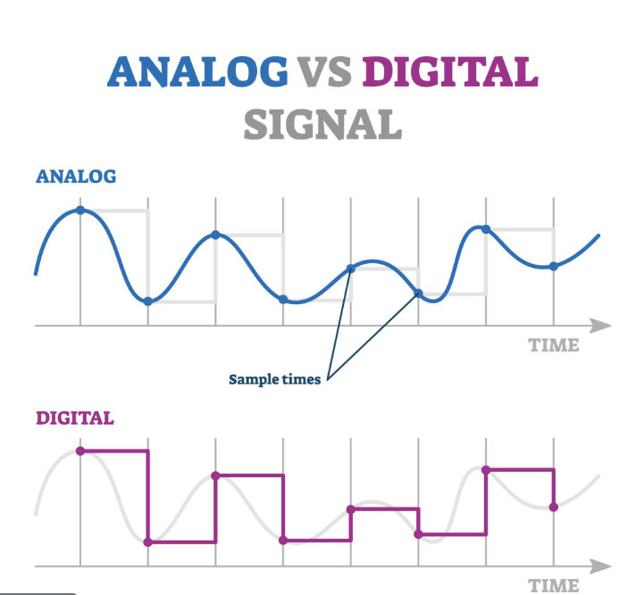

## 센서의 기본 개념 및 IR 센서 학습

1. 센서(Sensor)의 이해
정의 및 역할
센서는 물리적 환경(온도, 빛, 거리, 압력 등)을 감지하여 전기적 신호로 변환해 주는 장치입니다. 로봇의 '감각 기관' 역할을 수행합니다.

센서의 주요 유형
접촉/비접촉 센서: 터치 센서, 근접 센서 등.

상태 감지 센서: IMU(가속도, 자이로), GPS, 온도 센서 등.

시각/거리 센서: 카메라, LiDAR, 초음파 센서, IR(적외선) 센서.

신호 처리 핵심 개념
아날로그 vs 디지털 신호: * 아날로그는 시간에 따라 연속적으로 변하는 전압 신호이고, 디지털은 0과 1의 이산적인 신호입니다.

해상도(Resolution)와 정확도(Accuracy): 해상도는 측정할 수 있는 최소 단위이며, 정확도는 참값과 얼마나 일치하는지를 의미합니다.

응답 시간(Response Time) & 샘플링 속도(Sampling Rate): 로봇이 얼마나 빠르게 데이터를 읽고 반응할 수 있는지 결정합니다.

노이즈와 필터링: 외부 전자기파 등으로 인한 데이터 오염을 방지하기 위해 로우패스 필터(Low-pass filter) 등을 사용하여 신호를 정제합니다.

2. IR(적외선) 센서
기본 원리 및 구성
IR 센서는 적외선 발광부(LED)와 수광부(Phototransistor/Photodiode)로 구성됩니다. 발광부에서 쏜 적외선이 물체에 반사되어 돌아오면, 수광부가 이를 감지하여 물체의 유무나 거리를 판단합니다.

라인 트레이싱(Line Tracing)을 위한 특성
반사율 차이 활용: 바닥의 검은색 선(빛을 흡수)과 흰색 바닥(빛을 반사)의 반사율 차이를 이용합니다.

고감도 조절: 라인 트레이서용 IR 센서는 가변 저항을 통해 검은색과 흰색을 확실히 구분할 수 있도록 감도를 조절하는 것이 핵심입니다.

신호 처리 및 배치 시 유의사항
신호 처리: 수광부의 전압 변화를 비교기(Comparator)를 통해 디지털 값(0 또는 1)으로 변환하여 메인 보드로 전달합니다.

배치 시 유의사항:

지면과의 거리: 너무 멀면 반사된 빛이 돌아오지 않고, 너무 가까우면 센서가 오작동합니다. (보통 5~10mm 권장)

외란광 방지: 햇빛이나 실내등의 적외선이 들어오지 않도록 센서 주위를 검은색 수축 튜브나 가림막으로 감싸는 것이 좋습니다.