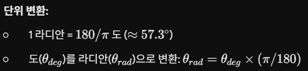
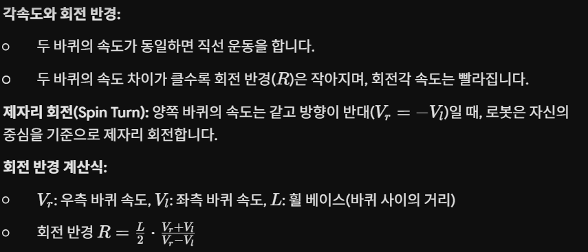

## 차동 구동 방식(Differential Drive) 연구

1. 라디안(Radian)의 이해
정의: 원의 반지름과 같은 길이를 갖는 호에 대한 중심각의 크기를 1라디안(rad)이라 합니다.

단위 변환:

용도: 회전각을 계산할 때 일반적인 각도(Degree)보다 수학적 계산(원주, 호의 길이 등)이 용이하여 로봇 제어 알고리즘에서 주로 사용합니다.

2. 차동 구동 방식(Differential Drive)의 개념
정의: 로봇의 좌우에 있는 두 개의 독립적인 모터를 각각 제어하여 속도와 회전 방향을 결정하는 방식입니다.

기본 원리: 두 바퀴의 속도 차이를 이용해 회전 중심(ICR, Instantaneous Center of Rotation)을 변경함으로써 로봇의 경로를 제어합니다.

3. 회전 메커니즘

4. 휠 베이스(Wheelbase)의 영향

휠 베이스: 두 바퀴 사이의 거리(L)입니다.

영향: 휠 베이스가 길수록 로봇의 직진 안정성은 향상되지만, 좁은 공간에서 회전할 때 더 넓은 회전 반경이 필요하여 기동성이 저하됩니다. 반대로 짧으면 기동성은 좋으나 제어의 민감도가 높아져 조향이 어려울 수 있습니다.