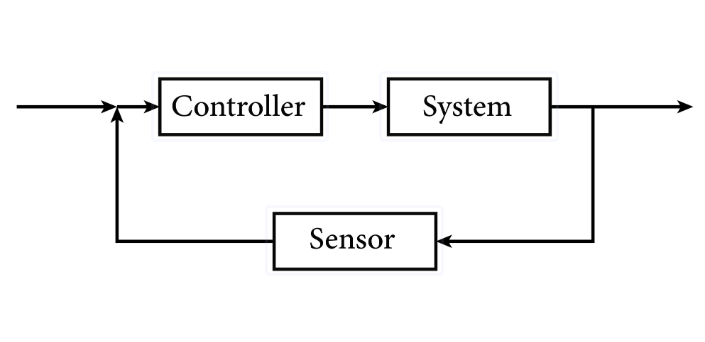
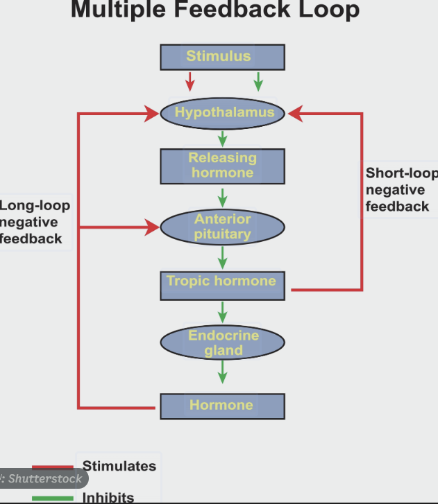
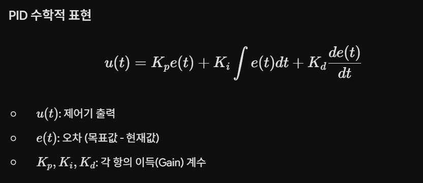
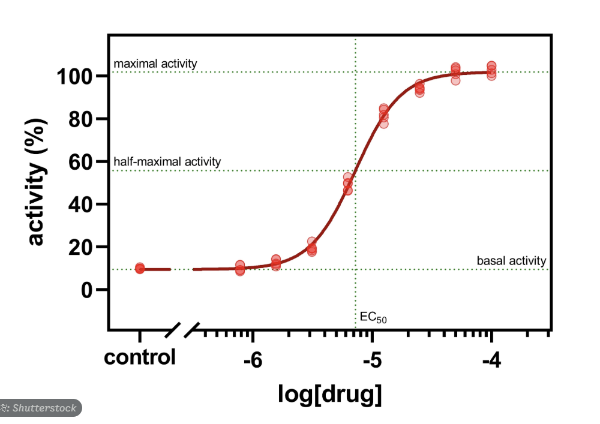

## 피드백 제어 및 PID 제어 이론

1. 제어 시스템의 기초
제어 시스템(Control System): 원하는 출력을 얻기 위해 입력 신호를 조절하는 장치들의 집합입니다.

제어의 목표: 시스템을 안정적(Stability)으로 만들고, 목표값에 빠르게(Speed) 도달하며, 오차를 줄여 정확하게(Accuracy) 유지하는 것입니다.

2. 피드백 제어의 개념
오픈 루프(Open Loop): 제어 결과가 입력에 영향을 주지 않는 방식 (예: 타이머 기반 세탁기).

클로즈드 루프(Closed Loop/Feedback): 출력값을 센서로 측정하여 목표값과 비교하고, 발생한 오차만큼 입력을 수정하는 방식.

핵심 구성:

목표값(Setpoint): 로봇이 도달해야 할 값.

오차(Error): (목표값 - 현재값).

제어기(Controller): 오차를 기반으로 조작량을 계산.

3. PID 제어
PID 제어는 P(비례), I(적분), D(미분) 항을 조합하여 오차를 0으로 수렴시키는 제어 방식입니다.

각 항의 역할

1. P (Proportional, 비례): 현재의 오차에 비례하여 제어. 빠르지만 정상 상태 오차가 발생할 수 있음.
2. I (Integral, 적분): 과거 오차의 누적값. 오차를 0으로 줄여주지만, 과도하게 높으면 오버슈트(목표값 초과)가 발생함.
3. D (Derivative, 미분): 오차 변화의 속도(미래 예측). 급격한 변화를 막아 제어를 안정화함.

4. PID 튜닝(Tuning)

가장 적절한 K_p, K_i, K_d 값을 찾는 과정입니다.

방법:
1. K_i, K_d를 0으로 둔 상태에서 K_p를 올려 시스템이 응답하게 함.
2. 시스템이 불안정해지기 직전까지 K_p 조절.
3. K_d를 추가하여 진동을 억제.
4. 마지막으로 K_i를 사용하여 잔류 오차 제거.