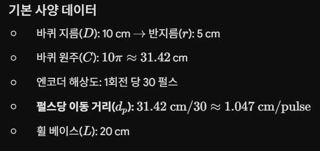
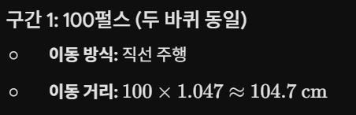
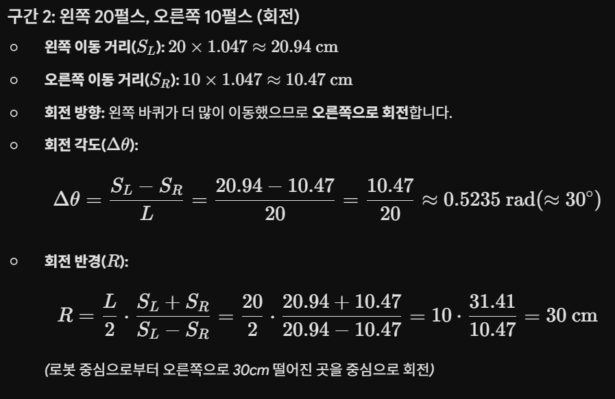

## 운반 로봇 제어 상황 분석 및 계산

1. IR 센서 경로 이탈 제어 절차
상황: 로봇이 정상 주행 중(000, 3개 센서 모두 검은색 경로 감지)에 센서값이 100(왼쪽 센서가 흰색 감지)으로 변경됨.

분석: * 센서 어레이(왼쪽, 중앙, 오른쪽) 중 왼쪽 센서가 흰색(1)을 감지했다는 것은 로봇이 경로(검은색)로부터 오른쪽으로 이탈했음을 의미합니다.

제어 절차

1. 오차 감지: 왼쪽 센서에서 신호(1)가 들어오는 즉시 제어 알고리즘은 '오른쪽 편향' 상태로 판단합니다.

2. 제어 입력 계산 (PID 제어)
- 왼쪽 센서의 이탈 거리를 오차값(e)으로 정의합니다.
- PID 제어기를 통해 조향값(Steering Value)을 산출합니다.
- 조향 방식: 왼쪽 바퀴 속도(V_L)를 증가시키고, 오른쪽 바퀴 속도(V_R)를 감소시켜 로봇을 왼쪽으로 회전시킵니다.

3. 경로 복귀: 중앙 센서가 다시 검은색(0)을 감지할 때까지 이 상태를 유지합니다.정상 주행: 모든 센서가 다시 000이 되면 PID 값을 초기화하거나 직선 주행 속도로 복귀합니다.

2. 주행 데이터 분석 및 이동 경로 계산
기본 사양 데이터

구간별 주행 분석

